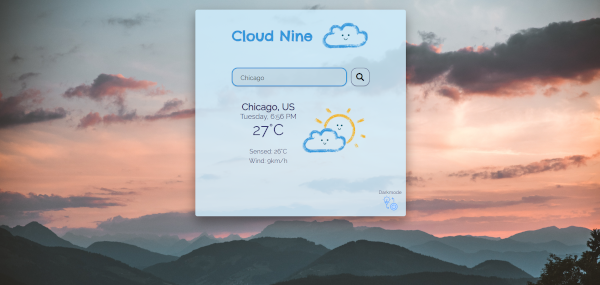

# Cloud Nine  
  
Simple weather app using OpenWeather API. You can check the current weather in the selected city.  
It was created using React hooks and context API (for theme change).
I am the author of all weather graphics :art:

## Demo
To view a demo [click here](https://rafal-ploszka-cloud-nine.herokuapp.com/).

## Getting started
Clone down this repo. You will need node and npm installed globally on your machine.  
Sign up over at openweathermap.org to get an API key.  
`npm start` runs the app in the development mode.  

Open http://localhost:3000 to view it in the browser and check the weather anywhere :sunny:

## Author
Rafał Płoszka
